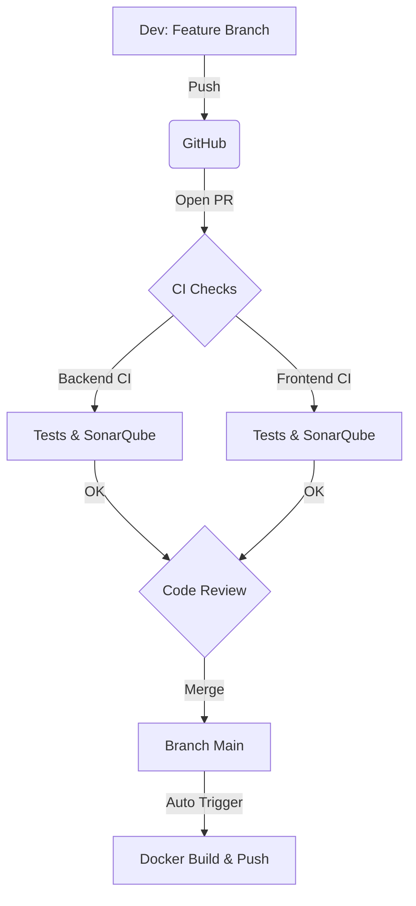

# Guide de Contribution - BobApp

Bienvenue sur le projet BobApp ! Ce document détaille les processus de développement, d'intégration continue (CI) et de déploiement continu (CD).

## 🔄 Workflow de Développement

Nous suivons un workflow strict basé sur les Pull Requests pour garantir la qualité du code.

### Processus étape par étape

1.  **Créer une branche** : `git checkout -b feat/ma-feature` ou `fix/mon-bug`.
2.  **Développer** : Effectuez vos modifications.
3.  **Tester localement** :
    *   Back: `mvn clean test`
    *   Front: `npm test`
4.  **Pousser** : `git push origin feat/ma-feature`.
5.  **Ouvrir une Pull Request** vers `main`.

---

## 🛠 Pipelines CI/CD

Le projet dispose de workflows GitHub Actions automatisés qui se déclenchent lors des Pull Requests et des merges sur `main`.

### 1. Validation Backend (`backend-ci.yml`)
Déclenché si modifications dans `back/**`.

*   **Compilation** : Maven (JDK 17)
*   **Tests** : Exécution des tests unitaires (`mvn test`)
*   **Couverture** : Génération rapport JaCoCo
*   **Qualité** : Analyse SonarQube

### 2. Validation Frontend (`frontend-ci.yml`)
Déclenché si modifications dans `front/**`.

*   **Installation** : `npm ci`
*   **Linting** : `npm run lint`
*   **Tests** : Karma/Jasmine avec ChromeHeadless
*   **Build** : `npm run build`
*   **Qualité** : Analyse SonarQube

### 3. Analyse Qualité (SonarQube)
Chaque PR est analysée pour respecter les critères suivants :

*   🛡️ **Vulnérabilités** : 0 critique
*   🐛 **Bugs** : 0 bloquant
*   📊 **Couverture de code** : Objectif > 80%

### 4. Déploiement Automatique
Une fois la PR mergée sur `main`, les images Docker sont construites et publiées :

*   **Backend** : `guillaume-leduc/bobapp-backend`
*   **Frontend** : `guillaume-leduc/bobapp-frontend`
*   **Vérification** : Des "Smoke Tests" valident que les conteneurs démarrent correctement avant le push sur le Docker Hub.

---

## 📏 Règles de Contribution

*   **Messages de commit** : Clairs et descriptifs (ex: `feat: add user login`, `fix: resolve issue #12`).
*   **Tests** : Toute nouvelle fonctionnalité doit être couverte par des tests unitaires.
*   **Code Style** : Respectez les standards existants (Java/Spring et TypeScript/Angular).
*   **Review** : Attendez que tous les checks CI soient verts ✅ avant de demander une revue.
